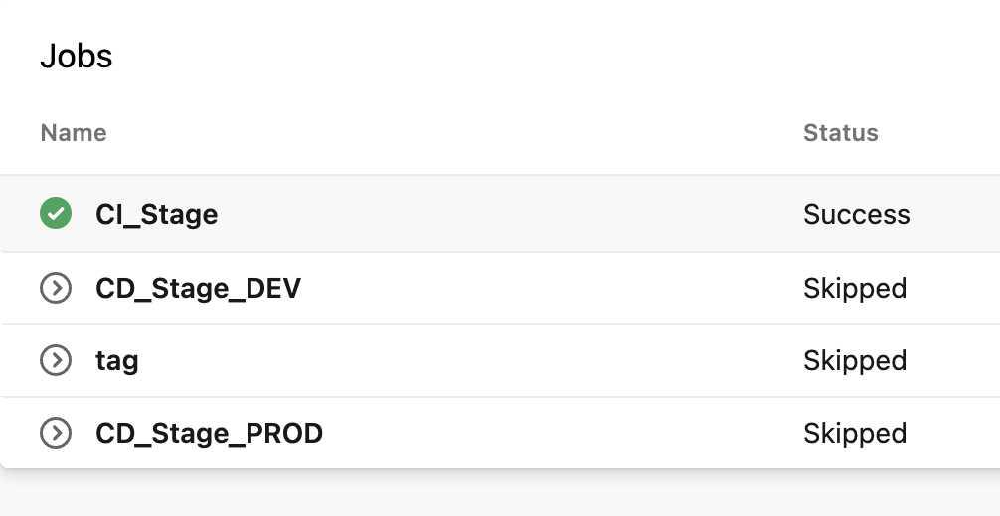
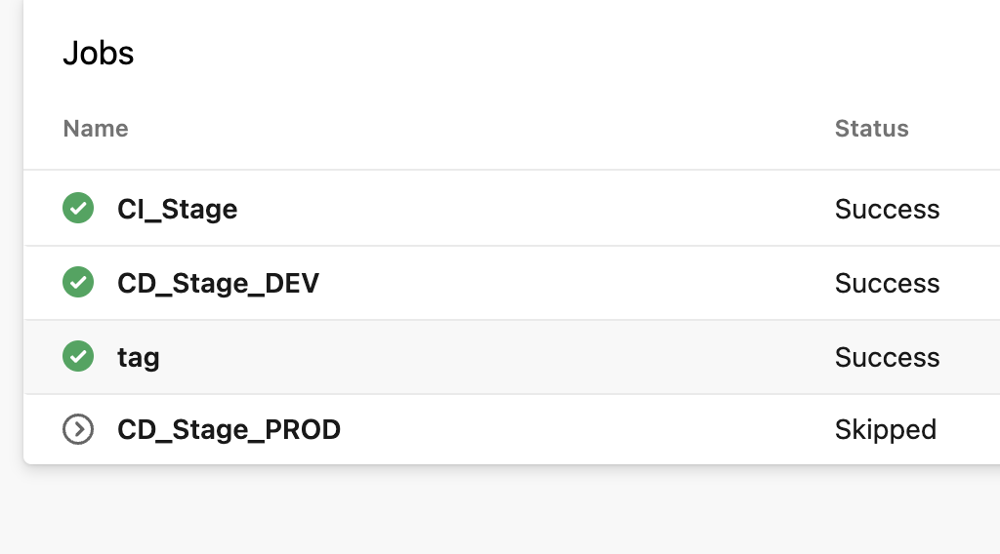
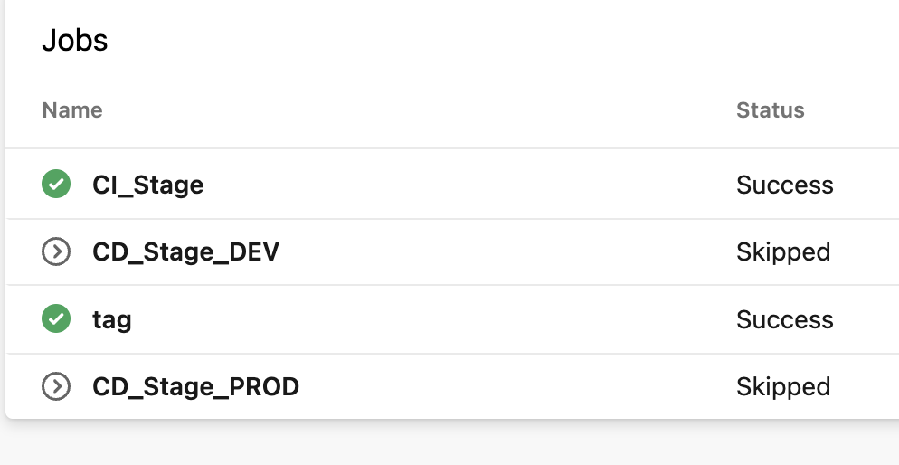
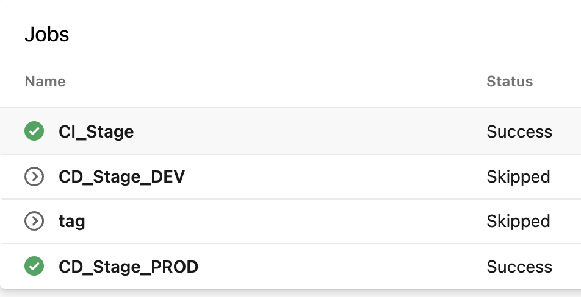

# Azure-Pipeline-Stages
manage Azure Pipeline with best practices

reference pipeline: [azure-pipelines.yml](https://github.com/ozbillwang/Azure-Pipeline-Best-Practices/blob/master/azure-pipelines.yml)
### CICD pipeline

I split the pipeline into 4 stages.

* commits to non-main branches, such as feature branches, bugfix branches

  - CI-Stage: unit test, lint, build, security tests, etc
  - ignore tag creation
  - manual triggered

* commits to dev branch or pull requests are merged to dev branch

  - CI-Stage: unit test, lint, build, security tests, etc
  - CD-Stage: deploy to develop environment
  - if all fine, create release tag
  - automatically triggered

* commits to master branch or pull requests are merged to master brach

  - CI-Stage: unit test, lint, build, security tests, etc
  - if all fine, create releaes tag
  - automatically triggered

Notes: currently in Azure, there is no suitable pipeline task to set the semantic versioning tag. I set the tag to `$(branchName)-$(Build.BuildNumber)`, for example `master-20210102.12`

* if new version detected (new tag applied on master branch)

  - CI-Stage: unit test, lint, build, security tests, etc
  - CD-Stage: deploy to production environment
  - ignore tag creation
  - manual triggered

You can add other environments, such as staging, production, for your project.

### Todo

- look for solution to create semantic version tags 
